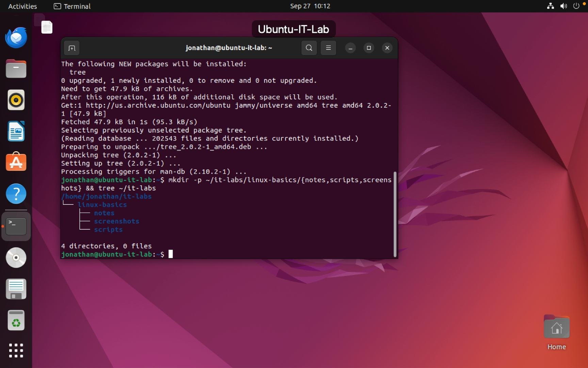
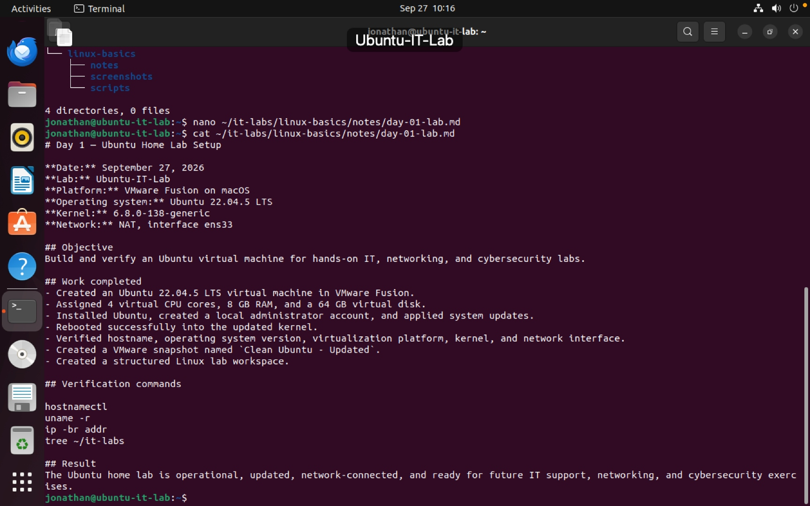
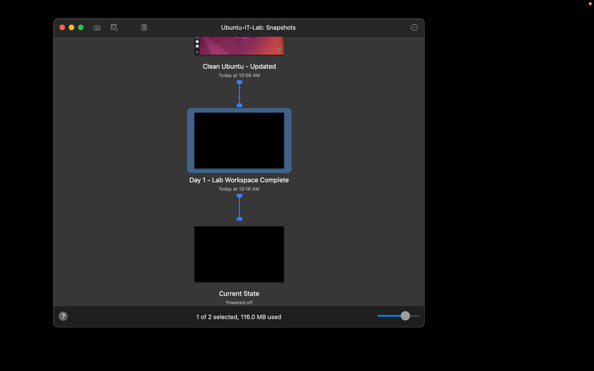

# Day 1 — Ubuntu Home Lab Setup

**Date:** September 27, 2026  
**Status:** Complete  
**Platform:** VMware Fusion on macOS  
**Virtual machine:** Ubuntu-IT-Lab  
**Operating system:** Ubuntu 22.04.5 LTS  

## Objective

Build, update, verify, document, and protect an Ubuntu virtual machine for future hands-on IT, networking, and cybersecurity labs.

## Work Completed

- Created an Ubuntu virtual machine named `Ubuntu-IT-Lab` in VMware Fusion.
- Installed Ubuntu 22.04.5 LTS.
- Applied available system updates and rebooted successfully.
- Installed the `tree` utility for viewing directory structures.
- Created a lab workspace at:

```text
~/it-labs/linux-basics/
├── notes/
├── screenshots/
└── scripts/
```

- Created and saved a local lab note:

```text
~/it-labs/linux-basics/notes/day-01-lab.md
```

- Created two VMware Fusion recovery snapshots:
  - `Clean Ubuntu - Updated`
  - `Day 1 - Lab Workspace Complete`

## Verification

The following commands confirmed the VM’s identity, system state, network interface, and lab-folder structure:

```bash
hostnamectl
uname -r
ip -br addr
tree ~/it-labs
```

## Result

The Ubuntu home lab is updated, documented, and protected by two recovery snapshots. It is ready for future IT support, networking, and cybersecurity exercises.

## Skills Practiced

- Ubuntu installation and basic administration
- Linux filesystem organization
- Package installation with APT
- Command-line navigation and verification
- Technical documentation with Markdown
- Virtual machine snapshot management

## Evidence

### Lab workspace created


### Lab notes saved and verified


### VMware Fusion recovery snapshots

