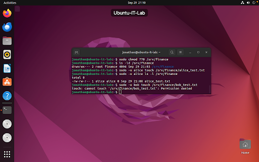
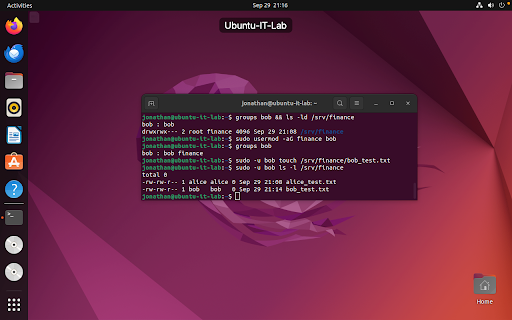
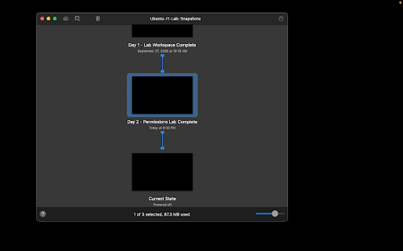

# Day 2 — Linux Users, Groups, and File Permissions

**Date:** September 29, 2026  
**Status:** Complete  
**Platform:** VMware Fusion on macOS  
**Virtual machine:** Ubuntu-IT-Lab  
**Operating system:** Ubuntu 22.04.5 LTS  

## Objective

Configure role-based access control (RBAC), enforce the principle of least privilege on a shared directory, and resolve a simulated user access ticket.

## Work Completed

- Verified administrative identity (`jonathan`) and `sudo` group membership.
- Provisioned employee accounts `alice` and `bob`.
- Created departmental group `finance` and assigned `alice`.
- Established shared directory `/srv/finance` with group ownership set to `finance`.
- Enforced `chmod 770` permissions so only `finance` group members can access the directory.
- Verified access control: `alice` successfully created a file, while `bob` was blocked (`Permission denied`).
- Resolved Ticket #1042: Added `bob` to the `finance` group after HR confirmation and verified access restoration.

- Created and saved a local lab note:

```text
~/it-labs/linux-basics/notes/day-02-lab.md
```

- Created a VMware Fusion recovery snapshot:
  - `Day 2 - Permissions Lab Complete`

## Verification

The following commands verified user identities, group memberships, directory ownership, permission enforcement, and ticket resolution:

```bash
whoami && id && groups
sudo adduser alice
sudo adduser bob
sudo groupadd finance
sudo usermod -aG finance alice
sudo mkdir -p /srv/finance
sudo chgrp finance /srv/finance
sudo chmod 770 /srv/finance
sudo -u alice touch /srv/finance/alice_test.txt
sudo -u bob touch /srv/finance/bob_test.txt
sudo usermod -aG finance bob
```

## Result

Role-based access control and least-privilege directory restrictions are fully operational, verified, and protected by a VMware completion snapshot. The VM is ready for future system administration exercises.

## Skills Practiced

- Linux user and group administration (adduser, groupadd, usermod)
- Role-based access control (RBAC) implementation
- File system security and permission management (chgrp, chmod 770)
- Principle of least privilege enforcement
- IT Help Desk ticketing and access troubleshooting
- Technical documentation with Markdown
- Virtual machine snapshot management

## Evidence

### Permissions enforcement and access testing


### Ticket resolution and group assignment


### VMware Fusion recovery snapshot

