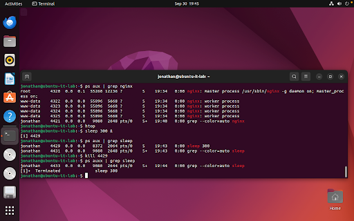
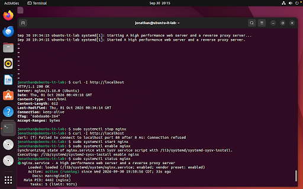
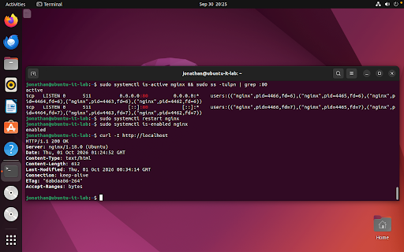
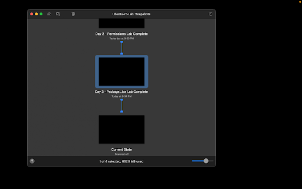

# Day 3 — Linux Package Management, Processes, and Services

**Date:** September 30, 2026  
**Status:** Complete  
**Platform:** VMware Fusion on macOS  
**Virtual machine:** Ubuntu-IT-Lab  
**Operating system:** Ubuntu 22.04.5 LTS  

## Objective

Manage software packages with `apt`, inspect and control running system processes with `ps`, `htop`, and `kill`, control system daemons with `systemctl`, and resolve a simulated web server outage ticket (#1043).

## Work Completed

- Refreshed package repositories (`sudo apt update`).
- Installed system utilities `nginx`, `htop`, and `curl` using `apt`.
- Inspected Nginx process hierarchies with `ps aux | grep nginx`.
- Monitored real-time system resource utilization in `htop`.
- Launched and terminated background processes using `sleep 300 &` and `kill`.
- Managed Nginx daemon lifecycle using `systemctl` (`status`, `stop`, `start`, `enable`).
- Tested HTTP connectivity locally using `curl -I http://localhost`.
- Resolved Ticket #1043: Diagnosed and restored an inactive web server service.

- Created and saved a local lab note:

```text
~/it-labs/linux-basics/notes/day-03-lab.md
```

- Created a VMware Fusion recovery snapshot:
  - `Day 3 - Package and Service Lab Complete`

## Verification

The following commands verified package installations, running processes, service control, and ticket resolution:

```bash
sudo apt update
sudo apt install -y nginx htop curl
which nginx htop curl
ps aux | grep nginx
htop
sleep 300 &
kill <PID>
sudo systemctl status nginx
curl -I http://localhost
sudo systemctl stop nginx
sudo systemctl start nginx
sudo systemctl enable nginx
sudo systemctl is-active nginx && sudo ss -tulpn | grep :80
```

## Result

Package management, process monitoring, and system service lifecycle management are fully operational, verified, and protected by a VMware completion snapshot. The VM is ready for future network and system administration exercises.

## Skills Practiced

- Package management using APT (apt update, apt install)
- Process monitoring and management (ps aux, htop, kill)
- Service daemon lifecycle management (systemctl)
- Web server connectivity testing (curl, socket inspection with ss)
- IT Help Desk ticketing and service recovery
- Technical documentation with Markdown
- Virtual machine snapshot management

## Evidence

### Process monitoring and termination


### Web server service lifecycle management


### Ticket #1043 resolution and service verification


### VMware Fusion recovery snapshot

